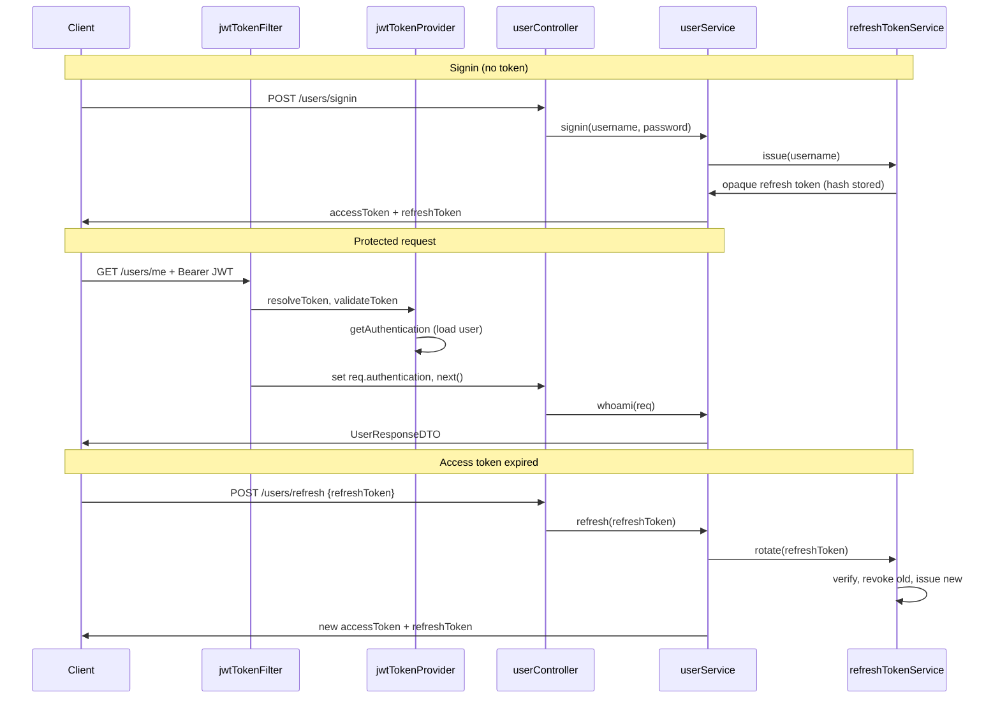

# JWT Auth Service (JavaScript)

A JWT authentication service built with Node.js and Express, using short-lived access tokens paired with rotating, revocable refresh tokens.

This is a port of [murraco/spring-boot-jwt](https://github.com/murraco/spring-boot-jwt) from Java/Spring Boot to JavaScript. The HTTP contract, the token format, the error responses and the security behaviour are unchanged — see [Migration from Spring Boot](#migration-from-spring-boot).

## Stack


## What is a JSON Web Token?

JSON Web Token (JWT) is an open standard (RFC 7519) that defines a compact and self-contained way for securely transmitting information between parties as a JSON object. The information can be verified and trusted because it is digitally signed — with a secret (HMAC) or a public/private key pair (RSA).

A JWT is three Base64url segments separated by dots, `xxxxx.yyyyy.zzzzz`:

1. **Header** — the token type and the signing algorithm, e.g. `{"alg":"HS256"}`.
2. **Payload** — the claims: statements about the user plus metadata, e.g. `{"sub":"admin","auth":["ROLE_ADMIN"],"iat":...,"exp":...}`.
3. **Signature** — `HMACSHA256(base64UrlEncode(header) + "." + base64UrlEncode(payload), secret)`, which proves both the sender's identity and that nothing was tampered with.

Once the user logs in, the token is returned and stored by the client. Every subsequent request carries it in the `Authorization: Bearer <token>` header; the server verifies the signature and reads the identity straight out of the payload, without a session store.

## JWT authentication summary

Token-based authentication brings real benefits over sessions and cookies: CORS works, no CSRF protection is needed, mobile clients integrate cleanly, the authorization server sees less load, and there is no distributed session store to run.

The trade-offs:

- more exposed to XSS attacks;
- an access token can carry outdated authorization claims (a revoked privilege stays in the token until it expires);
- tokens grow with the number of claims;
- file-download APIs get awkward;
- true statelessness and revocation are mutually exclusive.

That last trade-off is the one this project takes a position on: the access token is fully stateless and cannot be revoked, so it is kept short-lived, while the **refresh token is stateful and revocable**. Statelessness is preserved where it matters for throughput — ordinary API requests hit no database for authentication — and given up only on the comparatively rare refresh call. See [Refresh token design](#refresh-token-design).

## File structure

```
spring-boot-jwt-js/
 │
 ├── src/
 │   ├── configuration/
 │   │   └── openApiConfig.js        # the OpenAPI 3 document served at /v3/api-docs
 │   │
 │   ├── controller/
 │   │   └── userController.js       # the /users routes
 │   │
 │   ├── dto/
 │   │   └── index.js                # AuthResponseDTO + validation and mapping
 │   │
 │   ├── exception/
 │   │   ├── customException.js      # CustomException and the Spring Security exception types
 │   │   └── globalExceptionHandler.js
 │   │
 │   ├── http/
 │   │   ├── httpStatus.js
 │   │   └── sendError.js            # the response shape of HttpServletResponse#sendError
 │   │
 │   ├── model/
 │   │   ├── appUser.js
 │   │   ├── appUserRole.js
 │   │   └── refreshToken.js
 │   │
 │   ├── repository/
 │   │   ├── refreshTokenRepository.js
 │   │   └── userRepository.js
 │   │
 │   ├── security/
 │   │   ├── jwtTokenFilter.js
 │   │   ├── jwtTokenProvider.js
 │   │   ├── myUserDetails.js
 │   │   └── webSecurityConfig.js
 │   │
 │   ├── service/
 │   │   ├── refreshTokenService.js
 │   │   └── userService.js
 │   │
 │   ├── app.js                      # wiring, filter chain, demo-user seeding, listen
 │   ├── config.js                   # the environment placeholders from application.yml
 │   ├── db.js                       # in-memory datasource and schema
 │   └── logger.js
 │
 ├── test/
 │   └── userController.test.js
 │
 ├── .github/workflows/ci.yml
 ├── .gitignore
 ├── Dockerfile
 ├── LICENSE
 ├── README.md
 └── package.json
```

## Architecture overview

This is a REST API using the **access token + refresh token** pattern. Signin returns a pair:

- a short-lived **access token** — a stateless JWT sent as `Authorization: Bearer <token>` on every request;
- a long-lived **refresh token** — an opaque random string, stored server-side, used only to obtain a new access token.

The endpoints `/users/signin`, `/users/signup`, `/users/refresh` and `/users/logout` are public; all other endpoints require a valid access token. Roles `ROLE_ADMIN` and `ROLE_CLIENT` are enforced by a route guard.

| Method | Path | Auth | Description |
|--------|------|------|-------------|
| `POST` | `/users/signin` | — | Authenticates and returns a token pair |
| `POST` | `/users/signup` | — | Creates a user and returns a token pair |
| `POST` | `/users/refresh` | refresh token | Exchanges a refresh token for a new pair |
| `POST` | `/users/logout` | refresh token | Revokes a refresh token (`204`) |
| `GET`  | `/users/me` | `ROLE_ADMIN` or `ROLE_CLIENT` | The authenticated user's data |
| `GET`  | `/users/{username}` | `ROLE_ADMIN` | Looks up a user |
| `DELETE` | `/users/{username}` | `ROLE_ADMIN` | Deletes a user and their refresh tokens |



### JWT flow in this project

1. **Obtain tokens:** `POST /users/signin` with `username` and `password` (query or form params). The response is `{accessToken, refreshToken, tokenType, expiresIn}`.
2. **Call protected APIs:** send `Authorization: Bearer <accessToken>`.
3. **Filter chain:** `jwtTokenFilter` reads the header, verifies the token through `jwtTokenProvider`, loads the user through `myUserDetails`, and puts the result on `req.authentication`.
4. **Authorization:** routes are guarded by `preAuthorizeHasAnyRole('ROLE_ADMIN')` and friends, so only users with the right role get through.
5. **Renew:** when the access token expires (401), `POST /users/refresh` with the refresh token. No access token is required — that endpoint is deliberately outside the JWT filter, since the whole point is that it works once the access token is dead.
6. **Sign out:** `POST /users/logout` revokes the refresh token.

### Refresh token design

The access token stays stateless — no database lookup on ordinary requests. Revocability is confined to the refresh token, which is checked against the database each time it is used. Three properties are worth calling out:

- **Opaque, not a JWT.** Refresh tokens are 256 bits from `crypto.randomBytes`, Base64url-encoded. They carry no claims; their only meaning is the database row they point at, which is what makes them revocable.
- **Hashed at rest.** Only the SHA-256 hash is stored (`refresh_token.token_hash`), so a database leak does not hand out usable tokens — the same reasoning as password hashing.
- **Single-use, with reuse detection.** Every refresh consumes the presented token and returns a replacement. If a token that was already consumed is presented again, that means two parties hold it — the legitimate client and someone who copied it — so **every** refresh token for that user is revoked and the request is rejected. The user must sign in again; the thief is locked out too.

Tuning the two lifetimes is the main knob: a short `JWT_EXPIRE_MS` narrows the window in which a stolen access token is useful (it cannot be revoked before it expires), at the cost of more refresh round trips.

### Core code

1. `security/jwtTokenFilter.js` — turns a bearer token into `req.authentication`; skips the four public paths so a stale `Authorization` header cannot break a refresh; rejects a *bad* token outright with 401.
2. `security/jwtTokenProvider.js` — HS256 signing and verification. The configured secret is hashed with SHA-256 and those 256 bits are the HMAC key, which is what lets a short human-readable secret satisfy HS256's key-length requirement.
3. `security/webSecurityConfig.js` — bcrypt (cost 12), the authentication manager used by signin, the public-path rules, and the role guard.
4. `service/refreshTokenService.js` — issue / rotate / revoke / deleteAllForUser.
5. `exception/globalExceptionHandler.js` — the single error sink; every failure leaves through it with a consistent JSON body.
6. `configuration/openApiConfig.js` — the OpenAPI 3 document behind Swagger UI.

### Data store

The Java service runs an in-memory H2 database under the `dev` profile with `ddl-auto: create-drop`. The port uses the built-in `node:sqlite` module against `:memory:`, with the schema created at startup — no native modules, no external database, same "fresh schema on each restart" behaviour. `src/db.js` holds the three tables Hibernate would have generated: `app_user`, the `app_user_app_user_roles` join table for the `@ElementCollection`, and `refresh_token` with a unique `token_hash` and an index on `username`.

To point at a real database, replace `src/db.js` and the two repositories in `src/repository/` — everything above them talks to the repository interface, not to SQL.

## Quick start

### Configuration

For **production**, set the JWT secret via environment variables. The default `secret-key` is for local development only and must not be used in production.

| Variable | Description | Default |
|----------|-------------|---------|
| `JWT_SECRET` | Secret key used to sign JWT tokens. Use a long, random value (e.g. 256+ bits). | `secret-key` (dev only) |
| `JWT_EXPIRE_MS` | Access token validity in milliseconds. Keep it short — an access token cannot be revoked before it expires. | `300000` (5 minutes) |
| `JWT_REFRESH_EXPIRE_MS` | Refresh token validity in milliseconds. Determines how long a client can stay signed in without re-entering credentials. | `604800000` (7 days) |
| `PORT` | HTTP port. | `8080` |
| `BCRYPT_STRENGTH` | bcrypt cost factor for password hashing. | `12` |
| `LOG_LEVEL` | `debug`, `info`, `warn`, `error` or `off`. | `info` |

Example: `export JWT_SECRET=your-secure-random-secret` before running the application.

### Setup

1. Install **Node.js 24 or newer** (the `node:sqlite` module the datasource uses is available unflagged from Node 24).

2. Fork this repository and clone it

```
$ git clone https://github.com/<your-user>/spring-boot-jwt-js
```

3. Navigate into the folder

```
$ cd spring-boot-jwt-js
```

4. Install dependencies

```
$ npm install
```

5. Run the project

```
$ npm start
```

6. Open **Swagger UI**: **`http://localhost:8080/swagger-ui.html`** (redirects to `/swagger-ui/index.html`). OpenAPI JSON: **`http://localhost:8080/v3/api-docs`**. Click **Authorize**, select scheme **`bearerAuth`**, and enter `Bearer <your_jwt>`.

7. Make a GET request to `/users/me` to check you're not authenticated. You should receive a `403` with an `Access denied` message since you haven't set your valid JWT token yet

```
$ curl -X GET http://localhost:8080/users/me
```

8. Make a POST request to `/users/signin` with the default admin user we programmatically created to get a token pair

```
$ curl -X POST 'http://localhost:8080/users/signin?username=admin&password=admin123456'
```

```json
{
  "accessToken": "eyJhbGciOiJIUzI1NiJ9...",
  "refreshToken": "7-prsdY5Dcpup-zgr9tUiDAAPvqmpcvIm4vwSbdNFmg",
  "tokenType": "Bearer",
  "expiresIn": 300
}
```

To **sign up** a new user (also returns a token pair):

```
$ curl -X POST http://localhost:8080/users/signup -H "Content-Type: application/json" -d '{"username":"newuser","email":"new@example.com","password":"password8","appUserRoles":["ROLE_CLIENT"]}'
```

9. Add the access token as a header parameter and make the initial GET request to `/users/me` again

```
$ curl -X GET http://localhost:8080/users/me -H 'Authorization: Bearer <ACCESS_TOKEN>'
```

10. And that's it, congrats! You should get a similar response to this one, meaning that you're now authenticated

```json
{
  "id": 1,
  "username": "admin",
  "email": "admin@email.com",
  "appUserRoles": [
    "ROLE_ADMIN"
  ]
}
```

11. After `expiresIn` seconds the access token stops working and `/users/me` returns `401`. Exchange the refresh token for a fresh pair — note that no `Authorization` header is needed

```
$ curl -X POST http://localhost:8080/users/refresh -H "Content-Type: application/json" -d '{"refreshToken":"<REFRESH_TOKEN>"}'
```

The response has the same shape as signin. **The refresh token you just sent is now dead** — store the new one and use it for the next refresh. Replaying the old one returns `401` and revokes every refresh token for that user (see [Refresh token design](#refresh-token-design)).

12. To sign out, revoke the refresh token

```
$ curl -X POST http://localhost:8080/users/logout -H "Content-Type: application/json" -d '{"refreshToken":"<REFRESH_TOKEN>"}'
```

Returns `204 No Content`. The matching access token remains valid until it expires — that is the inherent trade-off of stateless access tokens, and the reason to keep `JWT_EXPIRE_MS` short.

**Demo users:** two accounts are created idempotently on startup — `admin` / `admin123456` and `client` / `client123456`. The store is in-memory, so they are recreated on each restart.

**Docker:** build and run with `docker build -t spring-boot-jwt-js .` then `docker run -p 8080:8080 spring-boot-jwt-js`. For production, pass `-e JWT_SECRET=your-secret`.

## Testing

Run the suite with:

```bash
$ npm test
```

`test/userController.test.js` drives the real Express application through supertest, with `node:test` as the runner. It is a line-by-line port of the Java `UserControllerTest` and covers the same fourteen cases: signin/signup, role-protected endpoints, and the refresh flow end to end — rotation on every refresh, rejection of a replayed token, revocation of the whole token family after reuse is detected, logout, and the case that matters most: refreshing while the `Authorization` header carries a dead access token.

## Migration from Spring Boot

The port keeps the observable behaviour of the Java service: same routes, same status codes, same JSON bodies, same token format. What changed is the machinery underneath.

| Java / Spring | JavaScript |
|---------------|------------|
| Spring MVC `@RestController` | Express `Router` (`controller/userController.js`) |
| Spring Security filter chain | ordered Express middleware in `app.js` |
| `JwtTokenFilter extends OncePerRequestFilter` | `createJwtTokenFilter()` middleware |
| `@PreAuthorize("hasRole('ROLE_ADMIN')")` | `preAuthorizeHasAnyRole('ROLE_ADMIN')` route guard |
| `AuthenticationManager` / `DaoAuthenticationProvider` | `createAuthenticationManager()` |
| `BCryptPasswordEncoder(12)` | `bcryptjs`, cost 12 |
| JJWT 0.12 (`Jwts.builder()`) | `jsonwebtoken` |
| Spring Data JPA repositories | prepared statements in `repository/` |
| H2 in-memory + `ddl-auto: create-drop` | `node:sqlite` `:memory:` + schema in `db.js` |
| Bean Validation (`@NotBlank`, `@Size`, `@Email`) | validators in `dto/index.js` |
| `ModelMapper` | explicit `toAppUser` / `toUserResponseDTO` |
| `@RestControllerAdvice` + `@ExceptionHandler` | `createGlobalExceptionHandler()` error middleware |
| `HttpServletResponse#sendError` + `DefaultErrorAttributes` | `sendError()` in `http/sendError.js` |
| SpringDoc OpenAPI annotations | the document in `configuration/openApiConfig.js` |
| `CommandLineRunner#run` | `run()` in `app.js` |
| SLF4J | `logger.js` |
| `@SpringBootTest` + MockMvc | `node:test` + supertest |
| Maven, `pom.xml` | npm, `package.json` |

Three points are worth spelling out:

- **Tokens are interchangeable.** The signing key is derived the same way (SHA-256 of the secret, used as the HMAC key) and the claim set and header are byte-identical, so a token minted by the Java service verifies in this one and vice versa. This was checked in both directions against JJWT 0.12.6.
- **`@Transactional(dontRollbackOn = CustomException.class)` has no counterpart.** The annotation exists in the Java `rotate` so that throwing after reuse detection does not roll back the revocation it just wrote. Here each statement commits as it runs, so the revocation is already durable when the 401 is thrown; there is nothing to opt out of.
- **A missing `@RequestParam` still yields 500, not 400.** In the Java service the failure escapes to the `@ExceptionHandler(Exception.class)` catch-all, and `requestParam()` reproduces that rather than quietly improving it, so both services answer a malformed signin identically.

## Contribution

- Report issues
- Open a pull request with improvements
- Spread the word

## License

Released under the [MIT License](LICENSE). The original Java project is © 2017 Mauricio Urraco.
